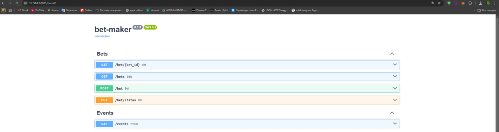

# Bet-maker Service

# In addition to this service, there is a **[line-provider](https://github.com/MaxShpud/line-provider)**. In order to use the beatmaker service, you must specify events in the line-provider.

## Overview


Go-to source for real-time, up-to-the-minute information on a wide array of events, all tailored to help you make smarter bets.

## Stack

- Python
- FastAPI
- Pydantic
- SQLAlchemy
- PostgreSQL
- Redis


## Architecture 
Simple layered architecture.

## Installation and Setup

### Prerequisites

Before you can run the Bilinz User Management Service, ensure that you have the following prerequisites installed:

- Docker
- Docker Compose

### Getting Started

1. Clone the repository to your local machine.

```bash
git clone git@github.com:MaxShpud/bet-maker.git
cd bet-maker
```

2. Build and start the application using Docker Compose. Run the following command to build the Docker images and start the services (backend, PostgreSQL, Redis) defined in the docker-compose.yml file:
```bash
docker-compose up --build
```
Docker Compose Services:
- bet-maker-backend: The backend service running the FastAPI app.
      - Accessible on port 8001.
      - Uses the Dockerfile in the project root to build the image.
      - Runs alembic upgrade head to apply any database migrations before starting the FastAPI server.
      - Depends on the PostgreSQL service.

- postgresql: The PostgreSQL service for the backend database.
      - Accessible on port 5434 on the host machine.
      - Uses the official postgres:16.2 image.
      - Environment variables such as POSTGRES_USER, POSTGRES_PASSWORD, and PGDATA are configured in the .env file.

- redis: The Redis service.
      - Accessible on port 6379 on the host machine.
      - Uses the official redis:7.2.5-alpine image.
      - Requires a password configured in the .env file.


### Running the Application

Once the services are up, you can access the Bet-maker backend via:
- http://localhost:8001 for the FastAPI application.

You can also interact with PostgreSQL and Redis using the following:
- PostgreSQL: Connect to localhost:5434 using the configured credentials.
- Redis: Connect to localhost:6379 with the configured password.

### Stopping the Services
To stop the services, run:
```bash
docker-compose down
```
This will stop and remove the containers, but it will not delete the volumes or network. If you want to clean everything up (including volumes), use:
```bash
docker-compose down -v
```

### API Documentation

Once the service is running, you can access the API documentation at `http://localhost:8001/docs` to explore and interact with the available endpoints.



### How the service works:
1) GET/bet/{bet_id} allows you to get information about the bid by ID
2) GET/bets allows you to get information about all bets. There is filtering by the status of the bet: UNFINISHED, WON, LOST
3) POST/bet allows you to place a bet on an event with the event ID and the amount of the bet.
4) PUT/bet/status allows updating statuses for events with the specified event_id.
5) GET/events allows you to get all the events that you can bet on.